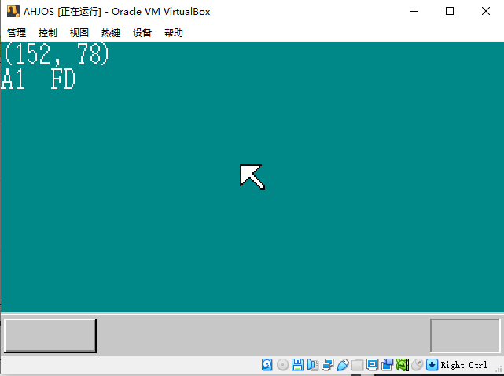
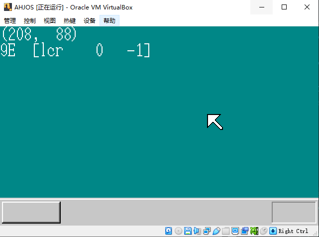
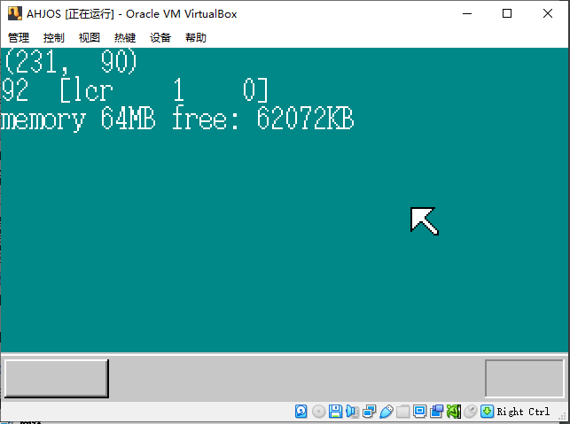
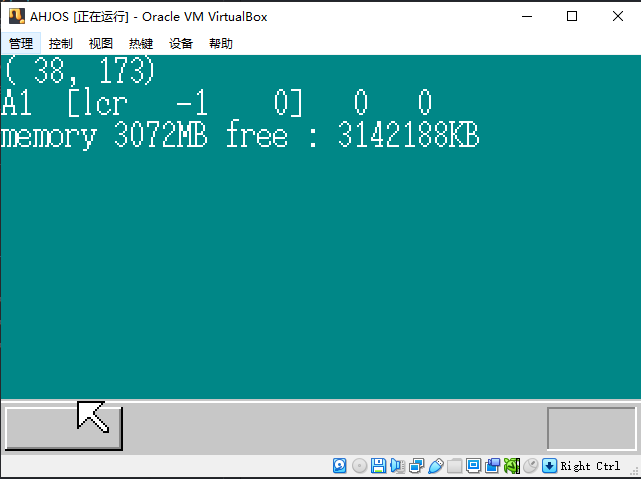

# AHJOS：自己动手编写的操作系统
参考《30天自制操作系统》，学习操作系统内部原理，并动手编写属于自己的操作系统（暂且不要脸地命名为AHJOS吧hhhhh）

原著将内容切分为30个章节（即30天），但本人由于沉迷此事导致一天不止推进一个章节，所以演化日志里面dayxx与日期并不对应，请莫见怪emmmmm。
## 学习笔记
* [AHJOS内存分布图](markdown/mem.md)
* [常用编译/反编译指令](markdown/sh_sample.md)
* [CPU寄存器](markdown/cpu_register.md)
* [BIOS程序指令](markdown/bios.md)

## 演化日志
### [**day01**，2023/1/26](day01/)
* 初次使用汇编语言编写程序
* 使用Bz.exe查看/编辑二进制文件
* 了解了如何制作FAT12格式启动区，并引导计算机启动

[helloos.img](day01/helloos.img)

### [**day02**，2023/1/26](day02/)
* 学习了部分CPU寄存器的使用方法
* 学习了Makefile的使用方法

[helloos02.2.img](day02/helloos02.2.img)

### [**day03**，2023/1/27](day03/)
* 制作了真正意义的IPL
* 学习了读取软盘至内存的方法，并读取至软盘的第10个柱面的第18个扇区
* 进入32位模式并导入C语言
* 控制VGA显卡，切换至320x200x8位彩色模式，并显示黑屏

[helloos03.img](day03/helloos03.img)

### [**day04**, 2023/1/27](day04/)
* 用C语言实现内存写入（显存）
* 编辑VGA显示调色板
* 显示器绘制矩形

[helloos04.img](day04/helloos04.img)

### [**day05**, 2023/1/27](day05/)
* 由内存接收启动信息
* 结构体struct的使用
* 使用OSASK字体数据
* 在屏幕显示字符（字符串）
* 使用sprintf显示变量
* 显示鼠标指针
* GDT与IDT初始化
  
[helloos05.img](day05/helloos05.img)

### [**day06**, 2023/1/28](day06/)
* 编写头文件，进行分割编译
* 组织了较为良好的工程目录
* 编写了中断处理函数
* 能够接收键盘中断

[helloos06.img](day06/helloos06.img)

### [**day07**, 2023/1/28](day07/)
* 接收键盘中断基础上，确定按下的按键与松开的按键
* 使用FIFO缓冲区接受键盘按键
* 能够接收鼠标中断

[helloos07.img](day07/helloos07.img)

### [**day08**, 2023/1/28](day08/)
* 解码鼠标数据
* 鼠标能动了！

[helloos08.img](day08/helloos08.img)

### [**day09**, 2023/1/28](day09/)
* 加入内存管理模块
* 实现基础的内存管理功能

[helloos09.img](day09/helloos09.img)

### [**day10**, 2023/1/28](day10/)
* 以4KB为单位进行内存管理，减少碎片化
* 基于图层，优化叠加处理，解决了鼠标与画面重叠问题

[ahjos10.img](day10/shj10.img)

